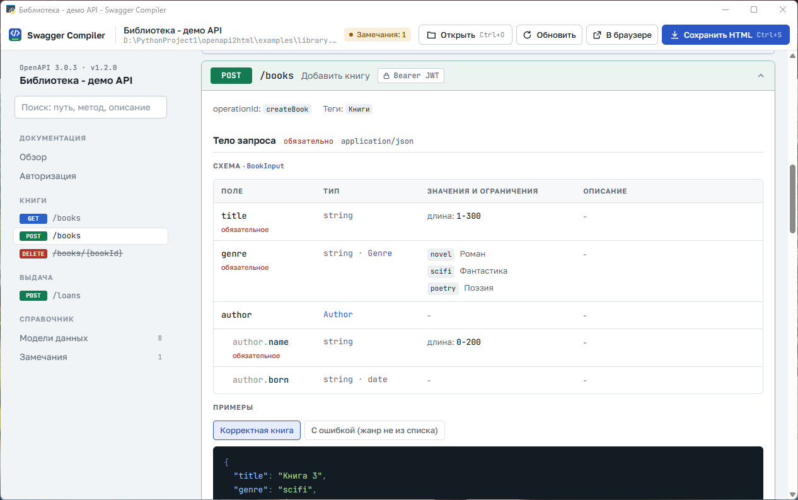
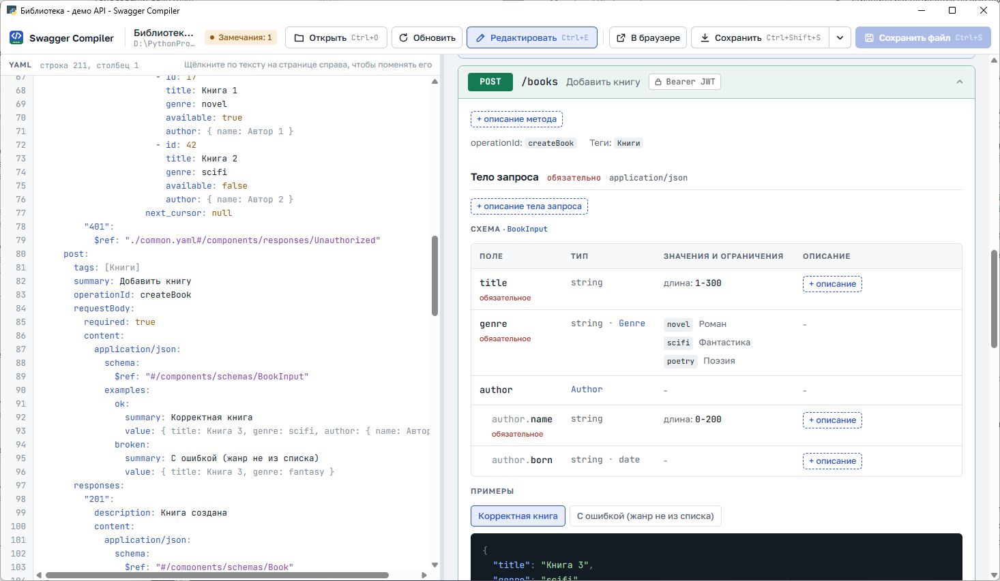

# Swagger Compiler

[Русский](README.md) | English

A Windows application for viewing, editing and publishing OpenAPI 3.x specifications.



The user interface and the generated documentation are in Russian.

## Features

**Viewing**
- Documentation for OpenAPI 3.0 and 3.1 specifications in YAML or JSON.
- Resolution of external `$ref` references to files in the same directory.
- Nested field tables; `allOf`, `oneOf`, `anyOf`, enumerations, constraints, `readOnly` and `writeOnly`.
- Request and response examples; an example is generated from the schema when none is defined.
- Validation of examples against their schemas and a list of specification issues.
- A curl command for every operation and request body validation against the schema.
- Operation search, grouping by tags, light and dark themes.

**Editing**
- YAML editor with syntax highlighting and live preview.
- In-place editing of text fields on the page. The rest of the file, including comments, remains unchanged.
- Tracking of unsaved changes and of changes made to the file by other programs.

**Export**
- Single-file HTML page with no external dependencies.
- Code for the Yandex Wiki HTML block.

## System requirements

- Windows 10 or 11.
- WebView2 Runtime (included in Windows 11 and most Windows 10 installations).
- To run from source: Python 3.8 or later.

## Installation

Download [`bin/SwaggerCompiler.exe`](bin/SwaggerCompiler.exe). No installation is required.

The executable is not signed. On first launch Windows may display a SmartScreen warning: select **More info**, then **Run anyway**.

## Usage

### Opening a specification

- The **Открыть** (Open) button or `Ctrl+O`.
- Drag and drop a file onto the application window or onto the `SwaggerCompiler.exe` icon.
- The recent files list on the start screen.

When another program modifies the file, the page is updated automatically.

### Saving

The **Сохранить** (Save) button saves the HTML page. The arrow next to it opens a menu:

| Menu item | Result |
|---|---|
| Сохранить HTML на компьютер (Save HTML to computer) | `.html` file with search, example switchers and request body validation |
| Скопировать HTML страницы (Copy page HTML) | The same HTML in the clipboard |
| Скопировать код для блока HTML (Copy code for the HTML block) | Yandex Wiki HTML block code in the clipboard |
| Сохранить код для Вики в файл (Save Wiki code to file) | Yandex Wiki HTML block code in a `.wiki.html` file |

### Publishing to Yandex Wiki

1. Open the specification.
2. Select **Сохранить** -> **Скопировать код для блока HTML**.
3. Add an HTML block to the Wiki page and paste the code.

The Yandex Wiki HTML block does not execute scripts and allows a limited set of CSS properties. The Wiki code complies with these rules: all sections are pre-rendered, examples are listed sequentially, operations and models collapse using standard `details` elements, and colors follow the Wiki theme. Search, example switchers and request body validation are not available in this variant.

CSS compliance with the Wiki rules is checked with `python tools/check_wiki_css.py`.

### Edit mode



Enabled with the **Редактировать** (Edit) button or `Ctrl+E`. The specification text is shown on the left and the page on the right.

- **In-place editing.** Click the API title or the description of an operation, parameter, field, request body, response or model. Change the text and select **Применить** (Apply) or press `Ctrl+Enter`. A "+ описание" (add description) button is shown where a description is missing.
- **YAML editor.** The page updates as you type. On a syntax error, a message with the line number appears below the editor; clicking it moves the cursor to that line.
- **Saving.** `Ctrl+S` writes changes to the file. With unsaved changes, the application asks for confirmation before closing the window or opening another file.
- **Changes by other programs.** Without unsaved changes, the text is reloaded automatically. Otherwise you can reload the file from disk or keep your changes.

Fragments included from external files via `$ref` cannot be edited on the page.

### Keyboard shortcuts

| Keys | Action |
|---|---|
| `Ctrl+O` | Open a file |
| `Ctrl+S` | Save HTML; in edit mode, save the specification file |
| `Ctrl+Shift+S` | Save HTML in edit mode |
| `Ctrl+E` | Toggle edit mode |
| `F5` | Reload the file from disk |
| `Ctrl+F` | Search operations |
| `Ctrl+Enter` | Apply a text change |

## Command line

The HTML page can be generated without opening the window:

```bash
pip install -r requirements.txt
python openapi2html.py spec.yaml
```

| Option | Purpose |
|---|---|
| `spec.yaml` | Create `spec.html` in the specification directory |
| `-o path.html` | Set the output file (single specification only) |
| `--open` | Open the result in a browser |
| `--no-open` | Do not open a browser |

Multiple files can be processed in one command: `python openapi2html.py a.yaml b.yaml`.

Application window from source: `python app.py [spec.yaml]`.

## Building

```bash
build_exe.bat
```

The script creates a `.venv` virtual environment, installs dependencies and PyInstaller, generates the icon and places the result in `bin/SwaggerCompiler.exe`. Rebuild after changing the interface, template, styles or page scripts.

## Project structure

| File | Purpose |
|---|---|
| `app.py` | Application window: dialogs, clipboard, recent files, change tracking |
| `app_ui.html` | Window interface: toolbar, editor, save menu |
| `openapi2html.py` | YAML and JSON parsing, `$ref` resolution, page generation; command-line mode |
| `yamledit.py` | Targeted value changes in YAML or JSON without reformatting the file |
| `template.html` | HTML page markup and styles |
| `renderer-core.js` | Schema tables, examples, data generation and validation against schemas |
| `renderer-page.js` | Page sections, navigation, search, curl, Wiki export |
| `wiki.css` | Styles for the Yandex Wiki code |
| `tools/check_wiki_css.py` | CSS check against the Yandex Wiki rules |
| `tools/make_icon.py` | Generation of `assets/app.ico` |
| `build_exe.bat` | Executable build |
| `examples/` | Demo specification |
| `docs/` | Documentation images |

## Limitations

- Swagger 2.0 specifications are not supported; convert them to OpenAPI 3 first.
- API requests are not sent; only a curl command is generated.
- HTML page fonts are loaded from the internet; system fonts are used when offline.
