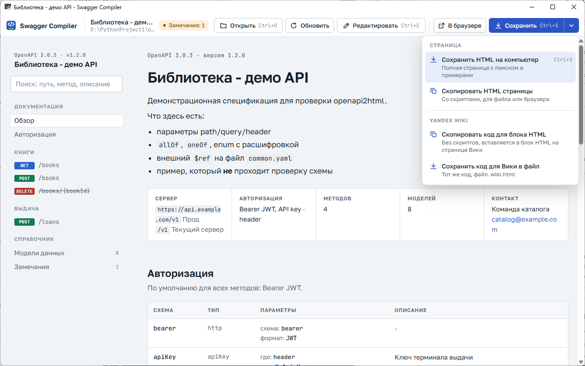

# Swagger Compiler

Русский | [English](README.en.md)

Приложение для Windows для просмотра, редактирования и публикации спецификаций OpenAPI 3.x.


## Возможности

**Просмотр**
- Документация по спецификации OpenAPI 3.0 и 3.1 в формате YAML или JSON.
- Разрешение внешних ссылок `$ref` на файлы в том же каталоге.
- Таблицы полей с вложенностью; `allOf`, `oneOf`, `anyOf`, перечисления, ограничения, `readOnly` и `writeOnly`.
- Примеры запросов и ответов; генерация примера по схеме, если пример не задан.
- Проверка примеров на соответствие схеме, список замечаний к спецификации.
- Команда curl для каждого метода, проверка тела запроса по схеме.
- Поиск по методам, группировка по тегам, светлая и тёмная тема.

**Редактирование**
- Редактор YAML с подсветкой синтаксиса и предпросмотром в реальном времени.
- Изменение текстовых полей непосредственно на странице. Остальной текст файла, включая комментарии, не изменяется.
- Контроль несохранённых изменений и изменений файла другими программами.

**Экспорт**
- HTML-страница в одном файле без внешних зависимостей.
- Код для HTML-блока Yandex Wiki.

## Системные требования

- Windows 10 или 11.
- Компонент WebView2 Runtime (входит в состав Windows 11 и большинства установок Windows 10).
- Для запуска из исходного кода: Python 3.8 или новее.

## Установка

Загрузите [`bin/SwaggerCompiler.exe`](bin/SwaggerCompiler.exe). Установка не требуется.

Исполняемый файл не подписан. При первом запуске Windows может показать предупреждение SmartScreen: выберите **Подробнее**, затем **Выполнить в любом случае**.

## Использование

### Открытие спецификации

- Кнопка **Открыть** или `Ctrl+O`.
- Перетаскивание файла в окно приложения или на значок `SwaggerCompiler.exe`.
- Список недавних файлов на стартовом экране.

При изменении файла другой программой страница обновляется автоматически.

### Сохранение

Кнопка **Сохранить** сохраняет HTML-страницу. Стрелка рядом с кнопкой открывает меню:

| Пункт меню | Результат |
|---|---|
| Сохранить HTML на компьютер | Файл `.html` с поиском, переключателями примеров и проверкой тела запроса |
| Скопировать HTML страницы | Тот же HTML в буфере обмена |
| Скопировать код для блока HTML | Код для HTML-блока Yandex Wiki в буфере обмена |
| Сохранить код для Вики в файл | Код для HTML-блока Yandex Wiki в файле `.wiki.html` |



### Публикация в Yandex Wiki

1. Откройте спецификацию.
2. Выберите **Сохранить** -> **Скопировать код для блока HTML**.
3. На странице Вики добавьте блок HTML и вставьте код.

HTML-блок Yandex Wiki не выполняет скрипты и допускает ограниченный набор CSS-свойств. Код для Вики формируется с учётом этих правил: все разделы отрисованы заранее, примеры выводятся последовательно, методы и модели сворачиваются стандартными элементами `details`, цвета соответствуют теме Вики. Поиск, переключатели примеров и проверка тела запроса в этом варианте недоступны.

Соответствие CSS правилам Вики проверяется командой `python tools/check_wiki_css.py`.

### Режим редактирования


Включается кнопкой **Редактировать** или `Ctrl+E`. Слева отображается текст спецификации, справа страница.

- **Изменение на странице.** Щёлкните название API, описание метода, параметра, поля, тела запроса, ответа или модели. Измените текст и нажмите **Применить** (`Ctrl+Enter`). Для отсутствующего описания отображается кнопка «+ описание».
- **Редактор YAML.** Страница обновляется по мере ввода. При синтаксической ошибке внизу редактора отображается сообщение с номером строки; щелчок по сообщению переводит курсор к строке.
- **Сохранение.** `Ctrl+S` записывает изменения в файл. При наличии несохранённых изменений приложение запрашивает подтверждение перед закрытием окна и открытием другого файла.
- **Изменение файла другой программой.** Без несохранённых изменений текст обновляется автоматически. При их наличии предлагается загрузить файл с диска или сохранить текущие изменения.

Фрагменты, подключённые из внешних файлов через `$ref`, на странице не редактируются.

### Горячие клавиши

| Клавиши | Действие |
|---|---|
| `Ctrl+O` | Открыть файл |
| `Ctrl+S` | Сохранить HTML; в режиме редактирования сохранить файл спецификации |
| `Ctrl+Shift+S` | Сохранить HTML в режиме редактирования |
| `Ctrl+E` | Включить или выключить режим редактирования |
| `F5` | Перечитать файл с диска |
| `Ctrl+F` | Поиск по методам |
| `Ctrl+Enter` | Применить изменение текста |

## Командная строка

HTML-страницу можно сформировать без запуска окна:

```bash
pip install -r requirements.txt
python openapi2html.py spec.yaml
```

| Параметр | Назначение |
|---|---|
| `spec.yaml` | Создать `spec.html` в каталоге спецификации |
| `-o путь.html` | Указать файл результата (для одной спецификации) |
| `--open` | Открыть результат в браузере |
| `--no-open` | Не открывать браузер |

Несколько файлов обрабатываются одной командой: `python openapi2html.py a.yaml b.yaml`.

Окно приложения из исходного кода: `python app.py [spec.yaml]`.

## Сборка

```bash
build_exe.bat
```

Скрипт создаёт виртуальное окружение `.venv`, устанавливает зависимости и PyInstaller, формирует иконку и помещает результат в `bin/SwaggerCompiler.exe`. После изменения интерфейса, шаблона, стилей или скриптов страницы требуется повторная сборка.

## Структура проекта

| Файл | Назначение |
|---|---|
| `app.py` | Окно приложения: диалоги, буфер обмена, недавние файлы, отслеживание изменений |
| `app_ui.html` | Интерфейс окна: панель, редактор, меню сохранения |
| `openapi2html.py` | Чтение YAML и JSON, разрешение `$ref`, сборка страницы; консольный режим |
| `yamledit.py` | Точечное изменение значения в YAML или JSON без переформатирования файла |
| `template.html` | Разметка и стили HTML-страницы |
| `renderer-core.js` | Таблицы схем, примеры, генерация и проверка данных по схеме |
| `renderer-page.js` | Разделы страницы, навигация, поиск, curl, экспорт для Вики |
| `wiki.css` | Стили кода для Yandex Wiki |
| `tools/check_wiki_css.py` | Проверка CSS по правилам Yandex Wiki |
| `tools/make_icon.py` | Формирование иконки `assets/app.ico` |
| `build_exe.bat` | Сборка исполняемого файла |
| `examples/` | Демонстрационная спецификация |
| `docs/` | Изображения для документации |

## Ограничения

- Спецификации Swagger 2.0 не поддерживаются; требуется преобразование в OpenAPI 3.
- Запросы к API не выполняются; формируется только команда curl.
- Шрифты HTML-страницы загружаются из интернета; при отсутствии сети используются системные шрифты.
